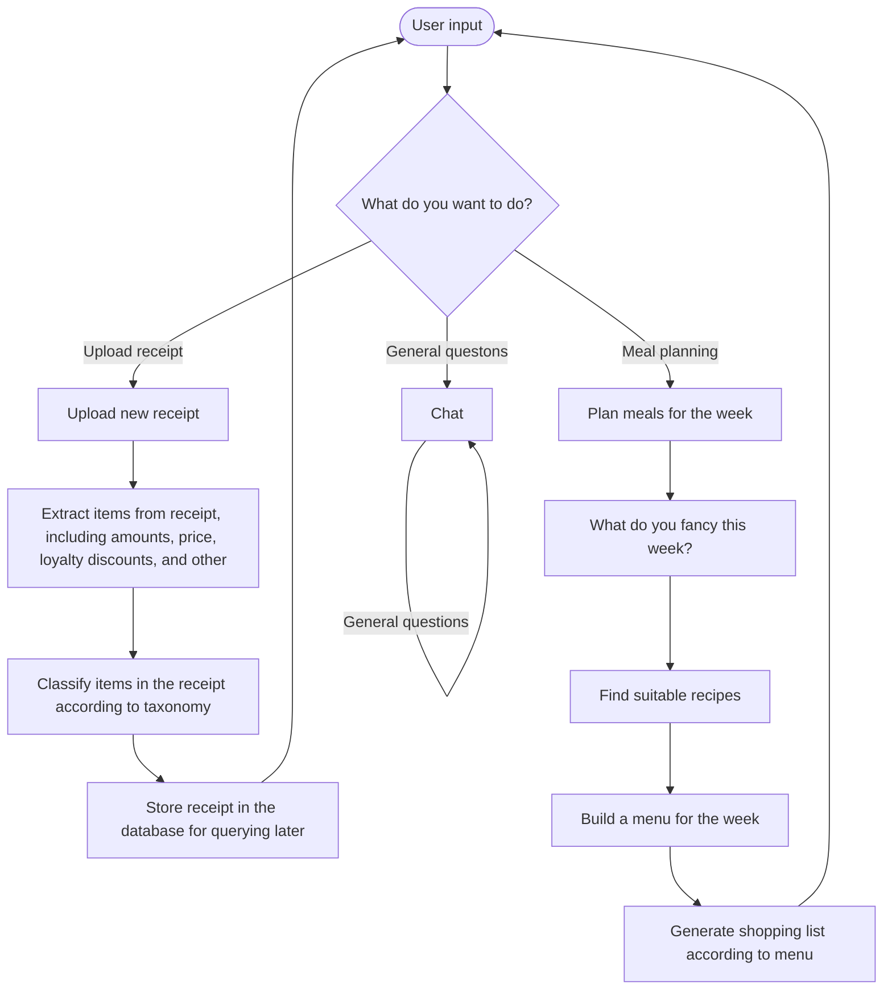

# Overview

The vision is that this application no longer has a user interface, but that it is fully based on an agentic
approach where functionality is triggered via chat.

## Agent flow



## Planner flow

The meal planner functionality works as follows:

1. The user suggests "I'd like help planning a meal/the week/whatever" or "what could I eat next week?"
2. The LLM should respond to try and find more information, such as: budget, number of meals preferred ingredients or recipes. The LLM should iterate here as many times as needed until it has all the information it needs.
3. The LLM should take all this information and come up with a plan (or full meal plan, depending on what's been asked)
4. For each meal in the plan, the LLM should return the list of ingredients as well as the price per ingredient using the available tool.

# Building a UI for it

The UI should provide the following functional (user-facing) features:

- Provide a chat-based and chat-centric interface for the user to interact with the application
- As the user progresses through the different flows and subflows, the application should identify the results and "bring" them into the user interace, e.g., keep a list of all the meal plans generated so far, keep a list of all the products identified so far, and so on. This is similiar to what the current ChatGPT does.

Technical features:

- It should be able to handle keeping track of history, and retrieving
- If needed, it should provide a view of the graph

## Getting graph information

Initialize a graph for playing around:

```
from agents.maingraph import MainGraph
from langgraph.checkpoint.memory import MemorySaver
memory=MemorySaver()
config={"configurable": {"thread_id": "1"}}
graph=MainGraph().as_subgraph().compile(checkpointer=memory)
result=graph.invoke({"messages": ["foo"] }, config=config)
```

class: StateSnapshot

```
graph.get_state(config)
```
